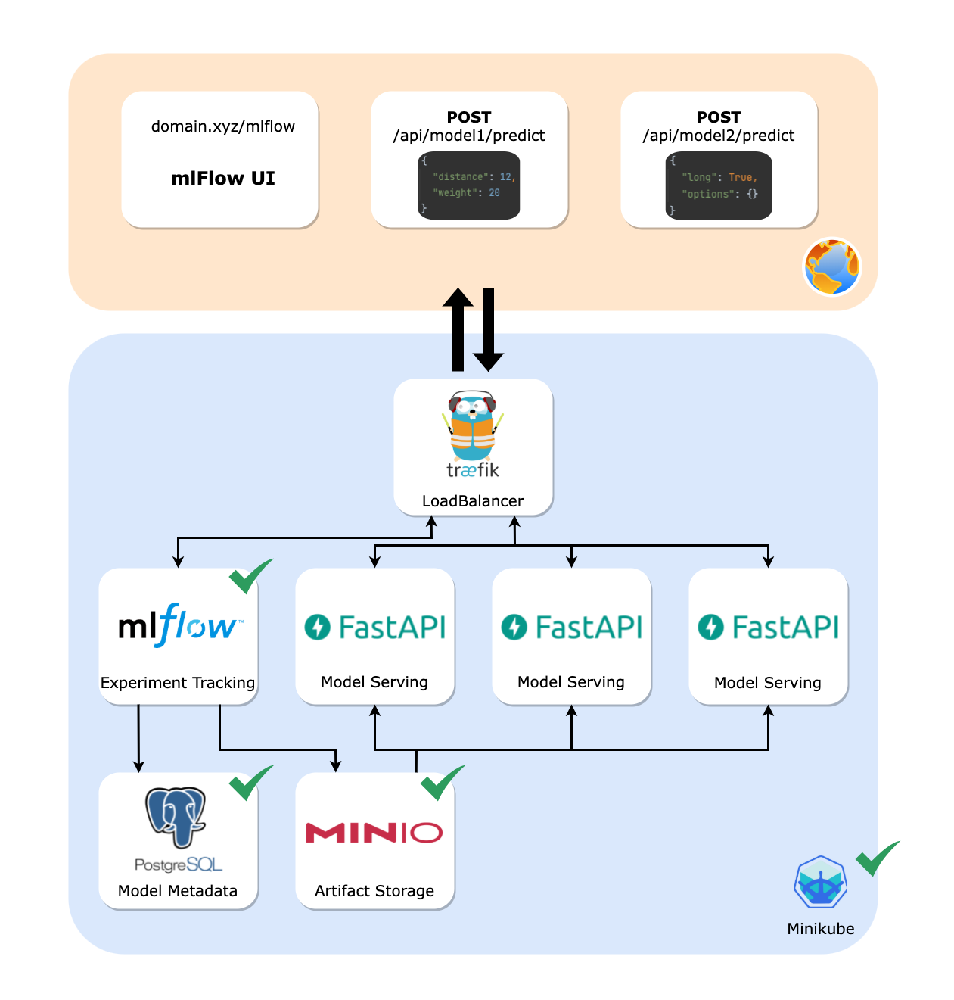

# mlplatform

### Design diagram

* Target architecture (checks for already accomplished services)

### Prerequisites

* `docker >= 20.10.20` (engine)
* `minikube >= 1.25.2` (running `kubernetes >=1.23.3`)
* `terraform >= 1.1.7`
* `poetry >= 1.1.13`